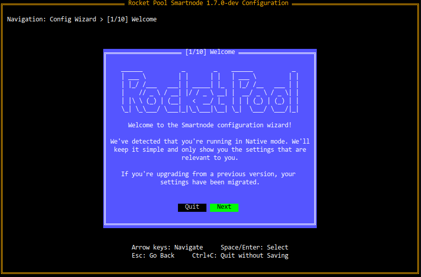
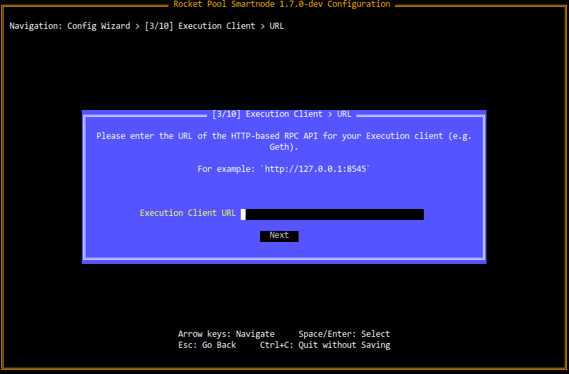
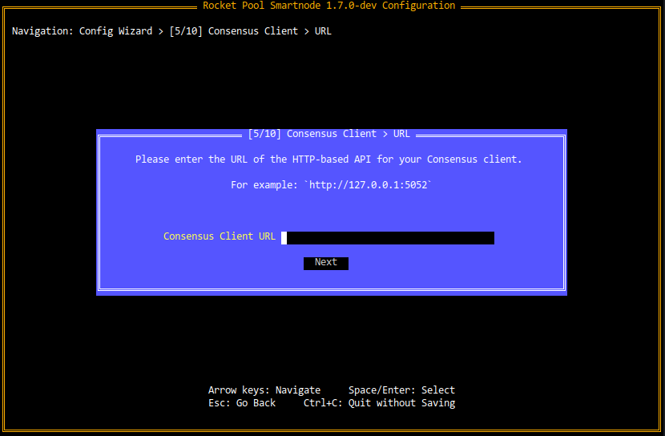
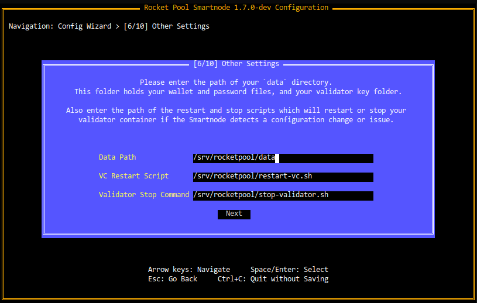
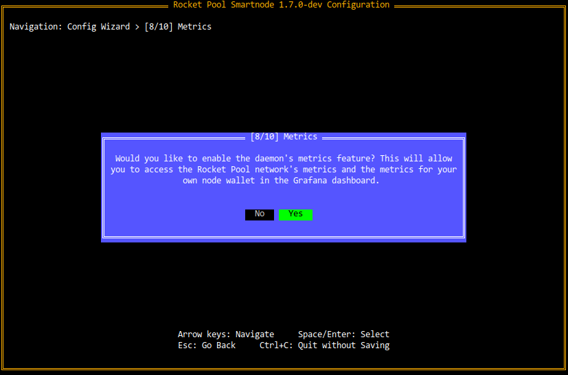
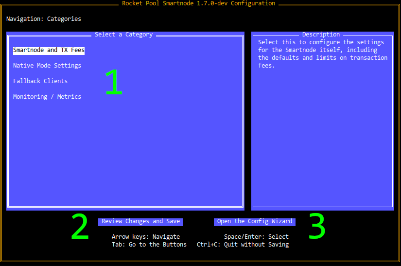

# Configuring the Smartnode Stack (Native Mode)

::: danger WARNING
This documentation is currently out of date with the release of Smartnode v1.5.0.

It will be updated shortly.
:::

In this section, we'll go over the various methods for configuring the Smartnode if you're using the **Native setup** that doesn't use Docker at all.

::: warning NOTE
If you're using a Docker-based setup, please visit the [Docker configuration guide](config-docker.md) instead. 
:::

There are three ways to configure it:

- Via the [Wizard UI](#configuring-via-the-wizard) - this is the easiest way. It only asks you a few basic question and uses well-tested defaults for the test. This will be what you are presented with when you run `rocketpool service config` for the first time.
- Via the [Settings Manager UI](#configuring-via-the-settings-manager) - this gives you access to all of the Smartnode's settings so you can customize everything as much as you want.
- Headlessly via the [Command Line](#configuring-via-the-command-line) - this is an option for people who run the Smartnode in a headless (non-interactive) environment and need to configure it automatically.

Choose which mode you'd like to learn more about from the list above, or simply scroll through each option below.


## Configuring via the Wizard

To configure the Smartnode, run the configuration command:

```
rp service config
```

This will launch a terminal-based UI that will allow you to quickly and easily configure your node, as well as provide optional fine-grained control over the settings that are relevant to Native mode.

::: tip NOTE
If you've already configured the Smartnode, you will instead be greeted with the [Settings Manager](#configuring-the-smartnode-stack-via-the-settings-manager).
You can choose to re-open the Wizard from there if you prefer it, and all of your existing settings will be pre-selected for you.
:::

When you run the config UI for the first time (or if you choose to run the Wizard again later), you will be presented with a screen that looks like this:

<center>



</center>

::: tip TIP
To use the Wizard, **press the `Arrow Keys` (up/down/left/right) to navigate between things such as buttons (choices) or text boxes**.
You can also use `Tab` and `Shift+Tab` if you prefer - it will do the same thing.

For buttons, **the one that's currently selected will be highlighted in green**.
The ones in black are not selected.
In the screenshot above, `Next` is currently selected and `Quit` is not.

**Press `Enter` or `Space` to select a button**, analogous to clicking on it with the mouse.

**Press `Escape` to go back to the previous dialog** if you changed your mind about something.
This will come in handy as you progress through the various Wizard pages.

**Hold `Ctrl` and press `C` at any time to exit the Wizard without saving anything**.

For example, on the screen above, you could press the `left` and `right` arrow keys to move between the `Next` and `Quit` buttons.

Pressing `Enter` while `Next` is selected will proceeed to the next screen.
Pressing `Enter` while `Quit` is selected will quit the Wizard without saving.
::: 

When you're ready to begin, press `Next`.


### Choosing a Network

In the next screen, you will be asked to choose which network you want to use:

<center>


</center>

You can highlight the different choices with the `Up` and `Down` arrow keys (or `Tab` and `Shift+Tab`).
When you change choices, the **Description** box on the right will show you a brief description of each option.
This is true for all choice-based pages in the Wizard, not just the network selection, so you will see this style of page frequently.

If you want to practice running a Rocket Pool node on the Prater test network with fake ETH and RPL you can get for free, select **Prater Testnet**.

If you're ready to create a real Rocket Pool node on Mainnet to earn real rewards, select **Mainnet**.


### Execution Client Setup

The next screen will prompt you for the URL of your Execution client's HTTP-based RPC API:

<center>



</center>

Enter `http://127.0.0.1:8545` here if you plan to run an Execution client on the same machine as the Smartnode (in the rest of this guide, we will assume this is what you plan to do).
However, if you already have an Execution client set up elsewhere, use its URL here instead.

Note that you can always change this by running `rp service config` again later.


### Consensus Client Setup

Next, you'll be asked which Consensus client you are using (or plan to use).
Because each Consensus client has slightly different behavior, the Smartnode needs to know which one you're using so it can adapt its own behavior accordingly.
Choose your client from the list in the following screen:

<center>


</center>

Next, you will see a screen prompting you for your client's API URL:

<center>



</center>

Enter `http://127.0.0.1:5052` here if you plan to run the Beacon Node of your Consensus client on the same machine as the Smartnode (in the rest of this guide, we will assume this is what you plan to do).
However, if you already have a Beacon Node set up elsewhere, use its URL here instead.


### Other Settings

The next screen will have a few other miscellaneous settings:

<center>



</center>

Leave these as the default options unless you have decided to use a directory other than `/srv/rocketpool` for your Smartnode installation.


### Metrics

Rocket Pool has the ability to integrate with Prometheus and Grafana to produce convenient web-based dashboards that let you observe your node's health at a glance:

<center>


</center>

The final question in the Wizard will ask you if you want to enable this:

<center>



</center>

If you choose to enable it, you will learn more about setting it up and how to use it in the [Setting up the Grafana Dashboard](./grafana.md) section later in the process.

::: warning NOTE
All of the data collected by this system **stays on your machine**.
Rocket Pool does not collect any of the telemetry or send it to a separate service.
It's purely there for you to use so you can monitor your own node!
:::

After this question, you've finished setting up the Smartnode configuration.
You will see the following dialog:

<center>


</center>

If you're happy with your setup and are ready to start the Smartnode, click `Save and Exit` here.

If you haven't finished installing Rocket Pool yet, return to the Native setup guide now.
Otherwise, the next step is to restart your daemon services with:

```
sudo systemctl restart rp-node rp-watchtower
```

If you would like to review all of the settings and customize many additional settings that weren't included in the Wizard, click `Review All Settings` and go to the [next section](#configuring-via-the-settings-manager).


## Configuring via the Settings Manager

If you've already run `rp service config`, instead of being greeted by the Wizard, you will see the **Settings Manager** screen:

<center>



</center>

There are three main features of this screen:

1. The **Category List**, which lets you drill down into the settings for each category of the Smartnode stack that is relevant to Native mode
2. The **Review Changes and Save** button, which you can use when you're ready to see what settings you've changed and save the updated configuration
3. The **Open the Config Wizard** button, which will bring you to the [Setup Wizard](#configuring-the-smartnode-stack-via-the-wizard) if you prefer that interface instead

::: tip TIP
To use the Settings Manager, **press the `Arrow Keys` (up/down/left/right) to navigate between options in the home page**.

Press `Tab` to go **between the category list (1) and the buttons (2 and 3)** at the bottom of the screen. 
The button that's currently selected will be **highlighted in green**.

**Press `Enter` or `Space` to select a button**, analogous to clicking on it with the mouse.

**Hold `Ctrl` and press `C` at any time to exit the Settings Manager without saving anything**.
:::

As you scroll through the categories list, each option will have a helpful description appear in the **Description Box** to the right of the screen.
Feel free to explore them; nothing you do will be saved until you go through the Review dialog via the **Review Changes and Save** button, and you can press **Ctrl+C** at any time to exit without saving, so you won't accidentally mess something up by playing with the settings here.


### Configuring the Settings

From the home screen, select any one of the categories with the `Enter` key to view the settings for that category.
For example, here is the screen for the **Smartnode and TX Fees** category:

<center>


</center>

Use the `Arrow Keys` to move up and down between the settings.
The currently selected one will have a white square at the end of it (if it's a text box or a check box), or will be highlighted in white (if it's a drop down).

Press `Escape` to go back to the home screen of the Settings Manager when you're done.

As you scroll through the settings, each one will show a brief description of what it does in the **Description Box** on the right.
It will also show the **default value** there in case you want to revert it to its stock setting.

In this example, the **RPL Claim Gas Threshold** setting is currently selected (highlighted with a green box on the left-hand side of the screen).
It has been changed to `40`, but you can see that it has a default of `150` in the top-right corner (the top of the **Description Box**).

::: tip TIP
As a reminder, nothing will be saved to disk until you go through the Review dialog via the **Review Changes and Save** button.
You are encouraged to explore all of the settings to learn about them.
:::


### The Setting Types and How to Use Them

The settings manager uses the following setting types and UI elements:

#### Text Boxes

Text boxes are used to enter arbitrary strings of text or numbers.
They look like this:

<center>


</center>

Enter your desired values into them, then **press `Enter` or use the `Arrow Keys` to navigate to a different setting in order to preserve your changes.**
If you don't, the Settings Manager will assume you're still updating that setting and won't mark it as changed yet.


#### Drop Downs

Drop downs are used to select an option from a list of choices.
They look like this (when they're open):

<center>


</center>

The **green** item is the one that is currently selected.
Use the `Arrow Keys` to change options - as you do, the **Description Box** on the right will update to tell you more about the currently selected option.
When you're happy with your choice, press `Enter` to choose the selected option and the drop down will close, revealing the option that is currently selected:

<center>


</center>


#### Check Boxes

Check boxes are used for simple Yes/No questions.
They look like this:

<center>


</center>

When they are checked, they will have an `X` in the middle as you see above.
When they are *unchecked*, they will simply be blank like this:

<center>


</center>

To change the setting, simply select it and press `Enter`.


### Saving Changes

When you're happy with your changes and you'd like to review them before saving, press the **Review Changes and Save** button on the home screen.
As a reminder, to get to it, press the `Tab` key.

You will be presented with a view that looks like this:

<center>


</center>

The **Review Box** here will present all of the settings you've changed, showing the old values and the new ones.
For example, the first line here shows that the **RPL Claim Gas Threshold** used to be `150`, and it's been changed to `40`.

::: tip NOTE
At this point, your changes **still haven't been saved yet**.
If you want to go back and modify something, press `Escape` to return to the home screen.
:::

When you are satisfied with the changes, press `Enter` to save the new configuration to disk.
You will then exit the Terminal UI and be presented with this message:

```
Your changes have been saved!
Please restart your daemon service for them to take effect.
```

If you haven't finished installing Rocket Pool yet, return to the Native setup guide now.
Otherwise, now you can restart your daemon services with:

```
sudo systemctl restart rp-node rp-watchtower
```


## Configuring via the Command Line

If you use the Smartnode in a headless environment where you can't interact with the Terminal UI, you can configure your node via the command line instead.

The `rocketpool service config` command accepts, as arguments, every setting that can normally be configured via the Terminal UI.
Run the following command to see a list of them (note that it's quite long):

```
rocketpool service config --help
```

The output will look like this:

```
NAME:
   rocketpool service config - Configure the Rocket Pool service

USAGE:
   rocketpool service config

OPTIONS:
   --executionClientMode value  Choose which mode to use for your Execution client - locally managed (Docker Mode), or externally managed (Hybrid Mode).
                                Type: choice
                                Options: local, external
 (default: "local")
   --executionClient value  Select which Execution client you would like to run.
                            Type: choice
                            Options: geth, infura, pocket
 (default: "geth")
   --useFallbackExecutionClient         Enable this if you would like to specify a fallback Execution client, which will temporarily be used by the Smartnode and your Consensus client if your primary Execution client ever goes offline.
                                        Type: bool

...
```

Each option will have its name, its type, its default value, and (if it's a choice parameter) its options.
Using this text, you can find the option(s) you want to set and specify them via the appropriate arguments.

::: tip NOTE
This command builds on top of your existing configuration, so if you have some settings already saved and just want to modify others, you don't need to repeat them.
It will only update settings that you include as arguments to this command.
:::

If you haven't finished installing Rocket Pool yet, return to the Native setup guide now.
Otherwise, the next step is to restart your daemon services with:

```
sudo systemctl restart rp-node rp-watchtower
```