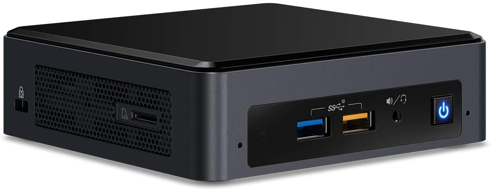

# :computer: Selecting Staking Hardware

TBD. This guide is for people that want to run a node at home (so no VPS). It is meant to capture some various options for node hardware based on my survey of the RP Discord server. Each option here comes from one user ("advocate"). For each one, I'm collecting the complete hardware laydown, the motivation for why the advocate selected it, and pros and cons.

## Full Server or PC

Running a Rocket Pool node 

### Xer0's Server

### Darcius's Shelf Rig

### Yorick's Mini / Micro ATX Build

## NUC (Next Unit of Computing)

Running a Rocket Pool node doesn't necessarily require a complete build-it-yourself desktop. In fact, one of the most popular setups among stakers is the illustrious NUC. A NUC (Next Unit of Computing) is essentially a small, self-contained computer that is designed around very low power usage and maximum efficiency. NUCs are great for most stakers that only run a few validators because of their low maintenance, low monthly running costs, and ease of setup. Below are a few examples of NUC setups that some Rocket Pool veterans use and recommend. 

### Ken's NUC8i5BEK

The NUC8i5BEK is one of Intel's own NUCs with an 8th-generation processor. Released in 2018, this model comes with a quad core i5-8259U CPU (2.30 GHz), two DDR4 slots, an M.2 slot for SSDs, and USB 3.1 ports. It normally draws about 20 watts, but Discord user Ken has been able to optimize it down to 9 watts during normal validation. It is more than capable of handling any ETH1 and any ETH2 client, making it an excellent choice for a lightweight, efficient node machine.

Ken's Setup:

- Base: [Intel NUC8i5BEK](https://www.amazon.com/Intel-NUC-Mainstream-Kit-NUC8i5BEK/dp/B07GX67SBM) ($349)
- RAM: [Dell Memory Upgrade - 1x16GB DDR4 SODIMM 3200MHz](https://www.dell.com/en-us/shop/dell-memory-upgrade-16gb-1rx8-ddr4-sodimm-3200mhz/apd/ab371022/memory) ($112)
- SSD: [ADATA XPG S7 Series 2TB M.2 2280 NVMe SSD](https://www.amazon.com/XPG-S7-Gen3x4-Solid-State/dp/B08BDZQJP5) ($230)
- Fanless Case (optional): [AKASA Turing Fanless case](https://www.amazon.com/Akasa-Compact-fanless-Generation-NUC45-M1B/dp/B07RTBF1SY) ($134)
- **Total: $691 to $825**

Here are Ken's comments on why he chose this setup:

*Small size and footprint, power supply is a brink on the power cord (like a laptop), single-board computer, x86 architecture, low purchase price point, low power consumption (~10W), 3-year warranty, and an active manufacture product line (intel). 8th generations are plenty fast and at a lower price point than the latest generation chips. I upgraded to a fan-less (passively cooled) case so the NUC is absolutely silent (0 db) as I’m leaving it my home office (a stock NUC is near silent already). Plus no mechanical wear on the fan bearings. Resale or re-purpose value if I decide to retire this hardware platform as my RP node - NUC’s make a great workstation computer.*

### GreyWizard's NUC 10 (BXNUC10I7FNH1)

### Actioncj17's PN50

### Moralcompass's Mini PC

## Raspberry Pi!

### Me!