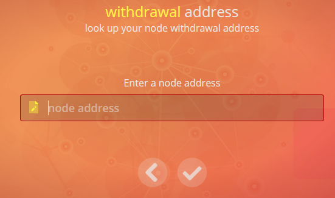
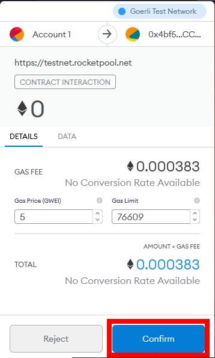

# Preparing your Node for Operation

If you're here, then you've succesfully started the Smartnode services, created a wallet, and finished syncing both the ETH1 and ETH2 chains on your respective clients. 
If so, then you are ready to register your node on the Rocket Pool network and create a minipool with an ETH2 validator!
If not, please review the previous sections and return here once you've completed those steps.

Before creating a new minipool and ETH2 validator, there are a few steps to take to finish preparing your node.
These only need to be done once though; once you've done them, you can skip to the [Creating a New Minipool](./create-validator.md) section if you want to create multiple minipools on your node.


## Loading your Node Wallet

Registering your node and standing up a validator both involve submitting transactions to the Ethereum network from your node wallet.
This means **you'll need to have some ETH on it** to pay for the gas costs of those transactions.
You'll also want to provide it with the **RPL token**, because you'll need to stake some of that prior to creating a minipool as collateral.

:::: tabs
::: tab Running on the Prater Test Network
If you're running on the Prater test network, please see the [Practicing with the Test Network](../testnet/overview.md) section to learn how to acquire test ETH.

For test RPL, we have added a similar faucet function directly to the CLI.
Please see the [Getting Test RPL on Goerli](../testnet/overview.md#getting-test-rpl-on-goerli) guide to acquire some.
:::
::: tab Running on the Main Network
We assume that you already have a separate Ethereum-compatible wallet that is holding your ETH and RPL tokens.
Start by transferring some ETH and RPL from your existing wallet to the node wallet.
As a reminder, you can use `rocketpool wallet status` to get the address of the node wallet if you need it.
If you are not sure how to send cryptocurrency from your existing wallet, please consult your wallet's documentation.

::: danger
Sending cryptocurrency across wallets is a non-reversible operation!
If you enter the wrong recipient address, **there is no way to retrieve your tokens**.
We recommend you send a small amount of ETH first as a **test transaction** to verify that you correctly entered the node wallet's address, and then **whitelist** that address in your other wallet, if possible, to avoid mistyping it.
:::
::::


## Registering your Node with the Network

Once you have ETH and RPL in your wallet, you can register your node with the Rocket Pool network to access all of its features.
To do this, run the following command:

```
rocketpool node register
```

This will prompt you for the timezone you want to register with.
By default, this will detect the timezone from your system clock, but you can change it if you prefer.
Any of the `Country/City` format timezones [listed on this page](https://en.wikipedia.org/wiki/List_of_tz_database_time_zones) should be acceptable.

::: tip NOTE
The timezone is just used for the global map of node operators displayed on the main site.
You don't need to set it to your actual timezone if you have security concerns.
If you prefer to remain anonymous, use a generic option such as `Etc/UTC`.
:::

Once this is complete, you will officially be a member of the Rocket Pool network!


## Setting your Withdrawal Address

Before anything else, we highly recommended you change the **withdrawal address** for your node.
This is the address that all of your RPL checkpoint rewards, your staked RPL, and your Beacon Chain ETH will be sent to when you claim your checkpoint rewards or exit your validator and withdraw from your minipool.

::: warning NOTE
By default, this is set to your node's wallet address.
However, for security reasons, **it's recommended to set this to a different cold wallet that you control, such as a MetaMask address or a hardware wallet.**

This way, if your node wallet is compromised, the attacker doesn't get access to your staked ETH and RPL by forcing you to exit because all of those funds will be sent to your separate cold wallet (which they hopefully do not have).

Withdrawal addresses are set at a node operator level. If you create multiple minipools they will all refer to the same withdrawal address. So you only need to perform this setup once.
:::

There are two different ways to do this.
Please read both options below to determine which one applies to you.

:::: tabs
::: tab Method 1
**Use this method if your new withdrawal address can be used to sign transactions via MetaMask or WalletConnect.**


1. Run `rocketpool node set-withdrawal-address <your cold wallet address>`. Your new withdrawal address will be marked as "pending". Until you confirm it, **your old withdrawal address will still be used**.
2. To confirm it, you must send a special transaction **from your new withdrawal address** to the minipool contract to verify that you own the withdrawal address.
   1. The easiest way to do this is to navigate to the Rocket Pool withdrawal address site (for the [Prater Testnet](https://testnet.rocketpool.net/withdrawal/) or for [Mainnet](https://stake.rocketpool.net/withdrawal/)).
   2. If you haven't already connected Metamask or WalletConnect to the Rocket Pool website, do this now. Click the **select wallet** button in the center of the screen, and choose MetaMask or WalletConnect based on which wallet you would like to use. You will then be prompted asking you to confirm the connection. For example, using MetaMask:
<center>

</center>
      Click **Next**, then click **Confirm** to enable the Rocket Pool website to use your wallet.
   3. Select **Withdrawal Address** from the top menu (or the hamburger menu on the left side if you're on a mobile device).
   4. You will see this prompt: 
<center>

</center>
      Type your **node wallet address** here and click on the **Check Mark button** to continue.
   5. You will be prompted with a question asking if you want to set a new node withdrawal address or confirm a pending one. Select **Confirm**.
   6. Now, there should be a new confirmation dialog in your wallet. Again, using MetaMask as an example, click the MetaMask icon to open it and you should see something like this:
<center>

</center>
      Click **Confirm** to send the transaction to the network. This will take some time until it gets mined, but once it does, you will see a confirmation dialog:
<center>

</center>
1. Your new withdrawal address will now be confirmed and activated. You can view this with `rocketpool node status`.
:::

::: tab Method 2

**Use this method only if your withdrawal address *cannot* be used to sign transactions via MetaMask or WalletConnect.**

In this method, you will run:

```
rocketpool node set-withdrawal-address --force <your cold wallet address>
```

You will be offered the chance to send a test transaction before confirming this, to ensure that you have the right address.
If you confirm this command when it prompts you, your new withdrawal address will be set immediately.

::: danger
By doing this, you bypass the safety measure associated with Method 1, which requires you to prove that you own the new address.
If you make a typo here, there is no way to undo it and **your minipool's rewards will be lost forever**.

We **strongly** encourage you to use the test transaction mechanism before confirming this, and if possible, use Method 1 instead.
:::
::::

Once this is done, you will **no longer be able to change your withdrawal address using the `set-withdrawal-address` command**.
To change it, you will need to send a signed transaction from your **active** withdrawal address (the one you just switched to).
The Rocket Pool website has a function to help you do this.


## Swapping RPL v1 for RPL v2

In many cases, the RPL that you start with is going to be the legacy RPL token that is no longer used.
Luckily, the CLI offers a function that allows you to easily swap it for the modern RPL token used by the network today.

**Swapping will be done at a 1-to-1 ratio**; if you have 1000 of the RPL v1 token, you can swap it for 1000 of the RPL v2 token.
All you will need to do is pay a small amount of gas for the transaction.

**This swap can be done at any time.**

To do this, run the following command:

```
rocketpool node swap-rpl
```

This will ask you if you want to swap all of the RPL v1 in your node wallet for RPL v2 or specify a custom amount.
When you've made your choice, confirm the transaction and wait for it to be processed and added to the blockchain.

Once the transaction is accepted, you can confirm that it worked with `rocketpool node status`:

```
The node <node address> has a balance of 131.973495 ETH and 1440.000000 RPL.

The node is registered with Rocket Pool with a timezone location of Etc/UTC.

The node has a total stake of 0.000000 RPL and an effective stake of 0.000000 RPL, allowing it to run 0 minipool(s) in total.
The node does not have any minipools yet.
```

You should see your new RPL v2 balance on the top line where it describes how much RPL you currently have.

With that, your node is prepared!
It's time to make a minipool and start staking your ETH.
Click on the next section to learn about that process next.