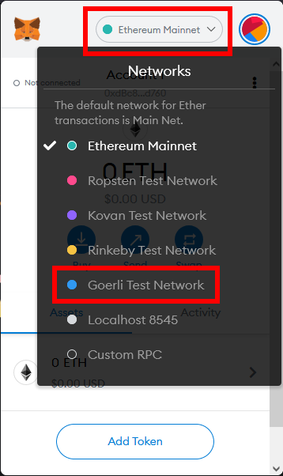
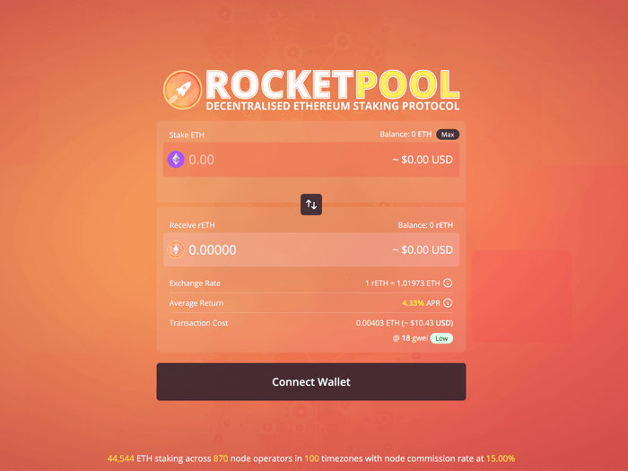
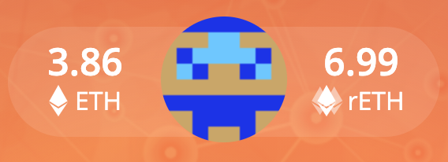
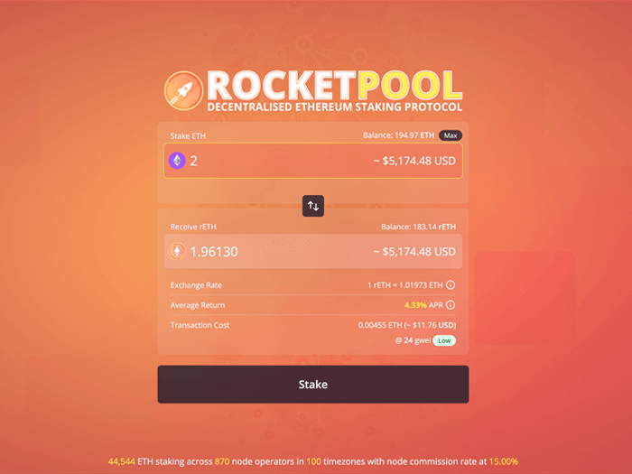
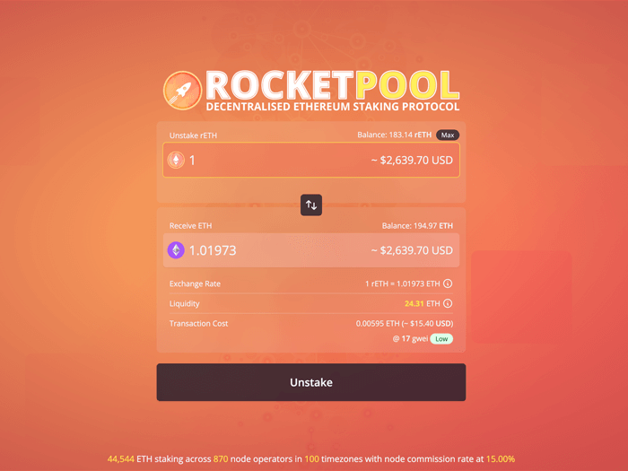

# How to Stake with Rocket Pool

In this guide, we'll walk you through the process of how to stake your ETH with Rocket Pool, providing it for Node Operators to create new ETH2 validators with.
As described in the [Staking Overview](overview.md), this will involve depositing your ETH into Rocket Pool's vault and receiving an equal value of rETH back.
By doing this, you will become a **Rocket Pool Staker**.

The easiest way to stake with Rocket Pool is done via its web interface to the underlying smart contracts.
You’ll need a computer with Google Chrome, Mozilla Firefox, Opera or Brave with [MetaMask](https://metamask.io/) installed, or a web3 enabled browser.

We will use MetaMask throughout this guide; if you’re using a web3 enabled browser, please consult its documentation for the relevant steps and match them with these instructions.

::: warning NOTE
Rocket Pool has not launched on mainnet yet, so you cannot currently stake real ETH.
However, you can practice staking with Rocket Pool using the Prater test network.

You **do not need to provide any of your real ETH** during this process.
You will be given **fake test ETH** to use instead.
:::


## Setting up MetaMask

Start by installing [MetaMask](https://metamask.io/) if you haven't already.
Follow the instructions on their site to install the extension, create an account, and sign in.

Next, open the MetaMask panel using its icon in your browser toolbar.
Click on the **network dropdown** in the toolbar at the top and select **Goerli Test Network**:

<center>



</center>

Finally, add the rETH token to MetaMask so you can see your balance and access it for trading.
Click the **Assets** tab, then click **Add Token**:

<center>


</center>

:::: tabs
::: tab Using the Prater Test Network
Ensure that **Custom Token** is selected in this dialog.
In the **Token Contract Address** box, put the following value:

```
0x178e141a0e3b34152f73ff610437a7bf9b83267a
```

The **Token Symbol** should automatically be populated with `rETH`, and the **Decimals of Precision** should automatically be populated with `18`.

Accept the rest of the prompts, and then you will see the rETH token appear in your list.
:::
::: tab Using Mainnet
Coming soon!
:::
::::


## Staking via the Rocket Pool Website

Select which network you're using from the tabs below.

:::: tabs
::: tab Using the Prater Test Network

Now that you have a wallet address in MetaMask, you need to fill it with some test ETH.
Head over to the [Practicing with the Test Network](../testnet/overview.md#getting-test-eth-on-goerli) page for a quick guide on how to use a testnet faucet to get some test ETH on Goerli.

Once you have some Goerli ETH to test with, head to [https://testnet.rocketpool.net/](https://testnet.rocketpool.net/).

The page should look like this:

<center>



</center>

If you see a notice about a web3 browser being required, or the current network ID being unsupported, make sure you’ve completed the previous steps correctly before continuing.

:::
::: tab Using Mainnet
Coming soon!
:::
::::

Once you're at the site, click on the **select wallet** button in the top middle of the page, then click **connect metamask**.

MetaMask will prompt you to select an account to connect to the website.
Choose one, confirm a few permissions, and you’ll see your account's icon along with your ETH and rETH balances - for example:

<center>



</center>

Now, all that's left to do is deposit your ETH and receive some rETH back!

Enter the amount of ETH you want to deposit in the **trade __ ETH** box on the screen, then check the **agree to terms of service** box and press **start**:

<center>



</center>

MetaMask will pop up with a window asking you to confirm your transaction.
Once you confirm it, the transaction will begin.
When it's been mined and added to the chain, you'll see your balances update!

::: tip NOTE
As described in the previous page, it's **completely normal** to receive less rETH than the amount of ETH you put in.
rETH and ETH have a **dynamic exchange rate**: as the Rocket Pool network earns rewards, 1 rETH will become worth more than 1 ETH, which in turn means 1 ETH will buy less than 1 rETH.
:::

That's it!
You're now staking with Rocket Pool.
All you need to do is hold onto your rETH, and you'll automatically gain your staking rewards as the value of the rETH token increases.


## Unstaking

When you're ready to unstake and trade your rETH back for ETH, head back to the staking website and click on the **double arrow button** in the middle of the trade amounts dialog to switch to rETH mode:

<center>



</center>

As with staking, enter an amount of rETH to trade back, agree to the Terms of Service, and click **start**.
Once again, a confirmation dialog will appear in MetaMask.
Confirm the transaction, and once it's been mined, you will see the proper balances in your wallet.

::: warning NOTE
Trading rETH back for ETH is only possible when the **staking liquidity pool** has enough ETH in it to handle your trade.
This is Rocket Pool's pool of ETH that comes from two sources:

1. ETH that other stakers have deposited, which hasn't been used by a Node Operator to create a new validator yet
1. ETH that was returned by a Node Operator after they exited one of their validators and received their rewards from the Beacon Chain (**note that this is not possible until after the ETH1-ETH2 Merge occurs and withdrawals are enabled**)

During the period before the Merge, it's possible that the liquidity pool won't have enough balance to cover your unstaking.
In this scenario, you may find other ways to trade your rETH back to ETH (such as a decentralized exchange like [Uniswap](https://app.uniswap.org/#/swap)) - though they will likely come with a small premium.
:::

That's all there is to staking with Rocket Pool!
We hope that you found the process quick and easy.

Feel free to swing by [our Discord server](https://discord.gg/G46XgK264a) to let us know what you thought of it and keep tabs on the project as it evolves.
